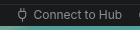
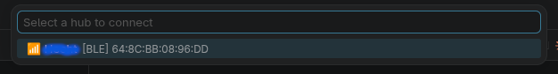
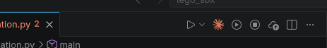
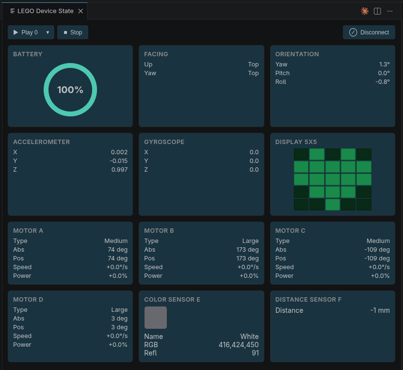

# LEGO Spike Prime VS Code Extension

A VS Code extension for programming the **LEGO SPIKE Prime Hub** — connect via Bluetooth or USB, run Python programs, upload projects, and monitor device state, all from your editor.

[](https://code.visualstudio.com)
[](https://marketplace.visualstudio.com/items?itemName=lego.lejo-spike-prime)
[](LICENSE)

---

## Features

- **Dual connection** — Connect to your SPIKE Prime Hub over Bluetooth Low Energy (BLE) or USB
- **Run programs** — Execute Python or compiled MicroPython programs directly on the hub
- **Upload to slots** — Save programs to 20 hub slots for later playback
- **Stop programs** — Halt running code with one click
- **Live device dashboard** — Monitor sensors, motors, battery, and LED state in real time
- **Status bar integration** — Quick connect/disconnect and hub status at a glance

---

## Prerequisites

Before using this extension, ensure the following are installed:

| Requirement | Why |
|---|---|
| [VS Code](https://code.visualstudio.com) 1.90+ | Extension host |
| [Node.js](https://nodejs.org) 20.x | BLE stack (noble) |
| [Python](https://python.org) 3.11+ | Helper processes |
| [`mpy-cross`](https://docs.micropython.org/en/latest/reference/mpycross.html) | Compile `.py` → `.mpy` |
| [`mpremote`](https://docs.micropython.org/en/latest/reference/mpremote.html) | USB communication with the hub |

> **Tip:** Install both tools at once with:
> ```bash
> pip install mpy-cross mpremote
> ```

### Linux — BLE Permissions

On Linux, the BLE scanner (`@stoprocent/noble`) requires native bindings and elevated permissions.

**1. Install development headers** (required for compilation):

```bash
# Fedora / RHEL
sudo dnf install -y bluez-libs-devel libusb1-devel

# Ubuntu / Debian
sudo apt install -y libbluetooth-dev libusb-1.0-0-dev
```

**2. Grant BLE permissions** (run once):

```bash
# Add your user to the bluetooth group
sudo usermod -aG bluetooth $USER

# Restart VS Code (or log out and back in)
```

> **Note:** The runtime `bluez` and `libusb1` packages alone are not sufficient — the
> development packages providing header files are required for the native addon
> to compile.

---

## Installation

### From VSIX (development / manual install)

```bash
npx vsce package            # Build lego-spike-prime-0.1.0.vsix
code --install-extension lego-spike-prime-0.1.0.vsix --force
```

### From GitHub Release

Install the latest pre-built release directly (requires VS Code 1.97+):

```bash
code --install-extension https://github.com/chilliwebs/lego-spike-prime-vsix/releases/download/v0.1.0/lego-spike-prime-0.1.0.vsix
```

Or download and install manually:

```bash
curl -L -o lego-spike-prime.vsix \
  "https://github.com/chilliwebs/lego-spike-prime-vsix/releases/download/v0.1.0/lego-spike-prime-0.1.0.vsix"
code --install-extension lego-spike-prime.vsix --force
```

### From VS Code Marketplace (published)

1. Open VS Code
2. Go to **Extensions** (`Ctrl+Shift+X` / `Cmd+Shift+X`)
3. Search for **"LEGO Spike Prime"**
4. Click **Install**

---

## Quick Start

### 1. Connect your hub

Click the **`(plug) Connect to Hub`** button in the status bar (bottom-left).



You'll see two options:

- **BLE** — Turn on your SPIKE Prime Hub and select it from the scanned devices
- **USB** — Plug the hub into your computer via USB-C

> **BLE tip:** Make sure your hub is powered on and in pairing mode before scanning.



### 2. Write a program

Create a new Python file and add a **slot comment** on the first line:

```python
# slot: 0

from spike import Motor, ColorSensor

left_motor = Motor('A')
right_motor = Motor('B')

left_motor.start(-50)
right_motor.start(-50)
```

The `# slot: N` comment tells the extension which hub slot to use (0–19). If omitted, you'll be prompted to pick a slot each time.

### 3. Run it

With the Python file open:

- Click the **`(play-circle) Run on Hub`** icon in the editor title bar, **or**
- Use the Command Palette: `LEGO Spike Prime: Run on Hub`

Your program will compile (if `.py`), upload to the specified slot, and start running on the hub.

---

## Available Commands

All commands are available in the Command Palette (`Ctrl+Shift+P` / `Cmd+Shift+P`).

| Command | Icon | Description |
|---|---|---|
| `LEGO Spike Prime: Connect to Hub` | `(plug)` | Scan for and connect to a SPIKE Prime Hub (BLE or USB) |
| `LEGO Spike Prime: Disconnect Hub` | `(circle-slash)` | Disconnect from the connected hub |
| `LEGO Spike Prime: Run on Hub` | `(play-circle)` | Compile and run the open Python file on the hub |
| `LEGO Spike Prime: Upload to Hub` | `(cloud-upload)` | Upload the open file to a hub slot (without running) |
| `LEGO Spike Prime: Stop Program` | `(stop-circle)` | Stop the currently running program on the hub |
| `LEGO Spike Prime: Show Device State` | `(output)` | Open the live device state dashboard |

### Editor shortcuts

When a Python file is open, three icons appear in the editor title bar:

- **▶ Run on Hub** — Runs the current file
- **☁ Upload to Hub** — Saves the current file to a slot
- **⬛ Stop Program** — Stops the running program



---

## How Slots Work

The SPIKE Prime Hub stores up to **20 programs** in numbered slots (0–19). Each slot holds one `.py` or `.mpy` file.

### The `# slot: N` convention

Add a comment to the first line of your Python file to specify the target slot:

```python
# slot: 3

# Your program here...
```

The extension will:

1. Read the slot number from the first line
2. Compile `.py` → `.mpy` if needed (via `mpy-cross`)
3. Upload the file to that slot on the hub
4. Optionally start it running

If no slot comment is present, you'll be prompted to pick one.

### Playing back saved programs

Once a program is uploaded to a slot, you can play it back on the hub without re-uploading. The extension supports triggering slot playback directly from the webview panel.

---

## Device State Dashboard

Click **`(output) Show Device State`** or select `LEGO Spike Prime: Show Device State` from the Command Palette to open a live dashboard panel showing:

- **Connection status** — BLE/USB, hub name, RSSI (signal strength)
- **Battery level** — Current charge percentage
- **Sensor readings** — Values from all connected sensors
- **Motor state** — Speed, position, and activity for each motor
- **LED controls** — Change the hub LED color

The dashboard updates in real time as the hub reports new data.



---

## Troubleshooting

### "BLE adapter not found" or scan fails on Linux

This is almost always a permissions issue:

1. Add your user to the `bluetooth` group: `sudo usermod -aG bluetooth $USER`
2. Log out and back in (or restart)
3. Ensure `bluez` is running: `systemctl status bluetooth`

### "mpy-cross not found" or "mpremote not found"

The extension will try to install these automatically on startup. If that fails:

```bash
pip install mpy-cross mpremote
```

Make sure `pip` is on your `PATH`. On some systems you may need `pip3` instead of `pip`.

### USB hub not detected

1. Try a different USB cable (some cables are charge-only)
2. Ensure the hub is powered on
3. On Linux, check udev rules for the LEGO USB device

### No hubs found during scan

- **BLE**: Make sure the hub is powered on and in pairing mode (hold the center button for 3+ seconds)
- **USB**: Check that the USB cable is plugged in firmly and the hub lights up
- Try running VS Code with elevated privileges (temporary workaround on Linux)

### Extension doesn't activate

Check the **LEGO Spike Prime** output channel:
1. Open Command Palette
2. Run `LEGO Spike Prime: Show Output Channel`
3. Look for errors or tool-check messages

---

## Output Channels

The extension uses two output channels for diagnostics:

| Channel | Purpose |
|---|---|
| **LEGO Spike Prime** | Connection state, scanning, commands, errors |
| **LEGO Spike Prime Console** | Live program output from the hub |

Access them via the Command Palette → `LEGO Spike Prime: Show Output Channel`.

---

## License

MIT